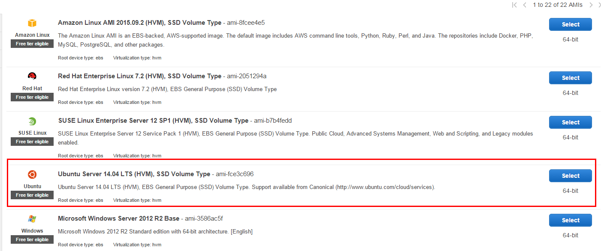
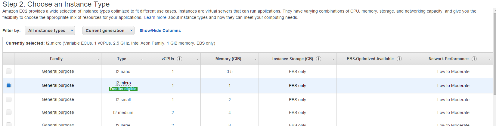
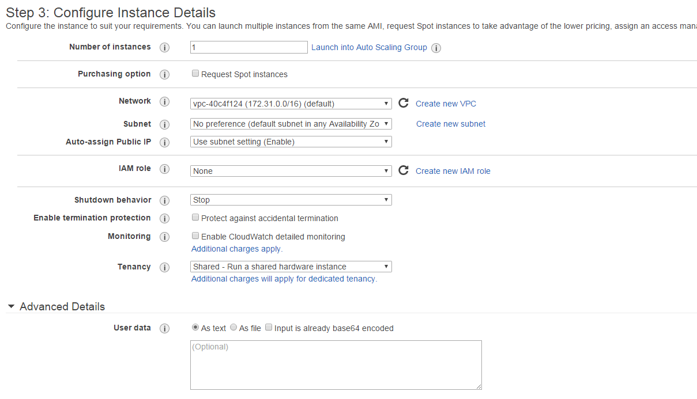
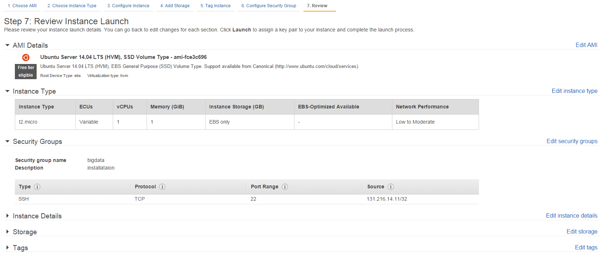
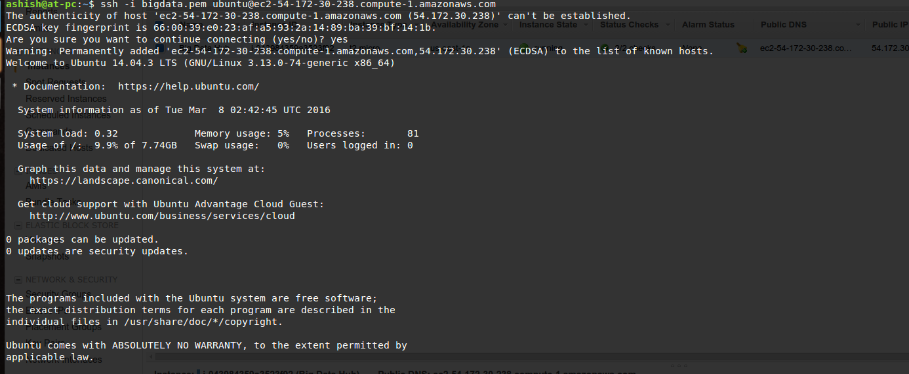

# Create the Amazon EC2 Instance (Ubuntu 14.04)

Steps to set up the Amazon AWS as,
### 1. Sign in to the AWS Console (Amazon Web Services)

### 2. Launch the Amazon EC2 Instance

	
### 3. Selecting the Amazon Machine Image

### 4. Choose an Instance Type

### 5. Configure Instance Details

### 6. Configure Security Group

### 7. Review and Launch Instance

### 8. Create key pair

### 9. Running instances
Now the instance is running and you click on the Instances on the left tab to see your EC2 instances running.

## To connect your Amazon EC2 instance using SSH from your local machine (Ubuntu)

In a command line shell, change directories to the location of the private key file that you created when you launched the instance.

Use the `chmod` command to make sure your private key file isn't publicly viewable. For example, if the name of your private key file is `big-data.pem`, use the following command:

    $ chmod 400 big-data.pem

Use the `ssh` command to connect to the instance. You'll specify the private key `(.pem)` file and `user_name@public_dns_name`. For Ubuntu, the username is `ubuntu`. 

    ssh -i big-data.pem ubuntu@ec2-198-51-100-1.compute-1.amazonaws.com

You'll see a response like the following:

    The authenticity of host 'ec2-198-51-100-1.compute-1.amazonaws.com (10.254.142.33)' can't be established.
    RSA key fingerprint is 1f:51:ae:28:bf:89:e9:d8:1f:25:5d:37:2d:7d:b8:ca:9f:f5:f1:6f.
    Are you sure you want to continue connecting (yes/no)?

(Optional) Verify that the fingerprint in the security alert matches the fingerprint that you obtained in step 1. If these fingerprints don't match, someone might be attempting a "man-in-the-middle" attack. If they match, continue to the next step.
Enter `yes`.
You'll see a response like the following.

    Warning: Permanently added 'ec2-198-51-100-1.compute-1.amazonaws.com' (RSA) 
    to the list of known hosts.

It looks something like this,

Reference: http://docs.aws.amazon.com/AWSEC2/latest/UserGuide/AccessingInstancesLinux.html

## Installation of Single Node Hadoop cluster on Ubuntu 14.04 Amazon EC2 Instance

### Install Java
You need to install java by following commands as,

    $ sudo add-apt-repository ppa:webupd8team/java
    $ sudo apt-get update
    $ sudo apt-get install oracle-java7-installer
    # Update Java runtime
    $ sudo update-java-alternatives -s java-7-oracle

To check whether your java is installed or not,

    $ java -version

### Disabling IPv6
To disable `ipv6`, you have to open `/etc/sysctl.conf` using any text editor and insert the following lines at the end:

    net.ipv6.conf.all.disable_ipv6 = 1
    net.ipv6.conf.default.disable_ipv6 = 1
    net.ipv6.conf.lo.disable_ipv6 = 1

If `ipv6` is still not disabled, then the problem is that `sysctl.conf` is still not activated.

To solve this, open a terminal(Ctrl+Alt+T) and type the command,

    $ sudo sysctl -p

You will see this in the terminal:

    net.ipv6.conf.all.disable_ipv6 = 1
    net.ipv6.conf.default.disable_ipv6 = 1
    net.ipv6.conf.lo.disable_ipv6 = 1

After that, if you run:

    $ cat /proc/sys/net/ipv6/conf/all/disable_ipv6

It will report:

    1

### Install Hadoop 2.6.0 stable binaries

Install the hadoop binary and then install it on the home folder itself.

    $ cd
    $ wget http://mirrors.sonic.net/apache/hadoop/common/hadoop-2.6.0/hadoop-2.6.0.tar.gz
    $ tar xvf hadoop-2.6.0.tar.gz
    $ mv hadoop-2.6.0 hadoop

### Create and Setup SSH Certificates
To create the ssh key, we create the following command as,

    $ ssh-keygen -t rsa -P ""

    Generating public/private rsa key pair.
    Enter file in which to save the key (/home/ubuntu/.ssh/id_rsa): 
    Created directory '/home/ubuntu/.ssh'.
    Your identification has been saved in /home/ubuntu/.ssh/id_rsa.
    Your public key has been saved in /home/ubuntu/.ssh/id_rsa.pub.
    The key fingerprint is:
    50:6b:f3:fc:0f:32:bf:30:79:c2:41:71:26:cc:7d:e3 ubuntu@laptop
    The key's randomart image is:
    +--[ RSA 2048]----+
    |        .oo.o    |
    |       . .o=. o  |
    |      . + .  o . |
    |       o =    E  |
    |        S +      |
    |         . +     |
    |          O +    |
    |           O o   |
    |            o..  |
    +-----------------+

You need to copy the key to the `authorized_keys`,

    $ cat $HOME/.ssh/id_rsa.pub >> $HOME/.ssh/authorized_keys

## Setting Up Hadoop Environment

### Configuring .bashrc file
You need to add the following lines on `.bashrc` file under the folder `/home/ubuntu` as,

    $ vim /home/ubuntu/.bashrc

Add the following lines:

    #HADOOP VARIABLES START
    export JAVA_HOME=/usr/lib/jvm/java-7-oracle
    export HADOOP_INSTALL=/home/ubuntu/hadoop
    export PATH=$PATH:$HADOOP_INSTALL/bin
    export PATH=$PATH:$HADOOP_INSTALL/sbin
    export HADOOP_MAPRED_HOME=$HADOOP_INSTALL
    export HADOOP_COMMON_HOME=$HADOOP_INSTALL
    export HADOOP_HDFS_HOME=$HADOOP_INSTALL
    export YARN_HOME=$HADOOP_INSTALL
    export HADOOP_COMMON_LIB_NATIVE_DIR=$HADOOP_INSTALL/lib/native
    export HADOOP_OPTS="-Djava.library.path=$HADOOP_INSTALL/lib/native"
    export HADOOP_CLASSPATH=${JAVA_HOME}/lib/tools.jar
    #HADOOP VARIABLES END

You need to re-load your `.bashrc` configuration. In order to reload, you can simply execute the following command as,

    $ source ~/.bashrc

### Update hadoop-env.sh
Update the `JAVA_HOME` in `/home/ubuntu/hadoop/etc/hadoop/hadoop-env.sh` as,

    $ vim /home/ubuntu/hadoop/etc/hadoop/hadoop-env.sh

Find the `export JAVA_HOME` line and replace `{JAVA_HOME}` with the actual path as,

    #Find this line and update with the path
    export JAVA_HOME=/usr/lib/jvm/java-7-oracle

## Configuring hadoop configuration files

### Add/Update core-site.xml
Add/Update the `core-site.xml` file by running the following command as,

    $ vim /home/ubuntu/hadoop/etc/hadoop/core-site.xml

Add the following code under the `<configuration></configuration>` as,

    <configuration>
    <property>
      <name>hadoop.tmp.dir</name>
      <value>/home/ubuntu/hadoop/tmp</value>
      <description>Temporary Directory.</description>
    </property>
    
    <property>
      <name>fs.default.name</name>
      <value>hdfs://localhost:54310</value>
      <description>Use HDFS as file storage engine</description>
    </property>
    </configuration>

Also, you need to create the `tmp` folder on `/home/ubuntu/hadoop` as,

    $ mkdir /home/ubuntu/hadoop/tmp

### Add/update mapred-site.xml
If you find the `mapred-site.xml` file inside `/home/ubuntu/hadoop/etc/hadoop/` then you just need to update inside the `mapred-site.xml` file as shown below. 
Otherwise, you need to copy the `mapred-site.xml.template` to create `mapred-site.xml` file as,

Commands to create the file (Skip this process if there is already `mapred-site.xml` file inside `/home/ubuntu/hadoop/etc/hadoop` folder),

    $ cd /home/ubuntu/hadoop/etc/hadoop
    $ cp mapred-site.xml.template mapred-site.xml
    $ vim mapred-site.xml

Now, update `mapred-site.xml` file under the `<configuration></configuration>` as,

    <configuration>
    	<property>
		<name>mapred.job.tracker</name>
		<value>localhost:54311</value>
		<description>The host and port that the MapReduce job tracker runs
		at.  If "local", then jobs are run in-process as a single map
		and reduce task.
		</description>
	 </property>
    </configuration>

### Add/update hdfs-site.xml
Updating the `hdfs-site.xml` file as,

    $ vim /home/ubuntu/hadoop/etc/hadoop/hdfs-site.xml

Edit the `hdfs-site.xml` file under the `<configuration></configuration>` as,

    <configuration>
      <property>
        <name>dfs.replication</name>
        <value>1</value>
        <description>Default block replication.
        The actual number of replications can be specified when the file is created.
        The default is used if replication is not specified in create time.
        </description>
      </property>
      <property>
         <name>dfs.namenode.name.dir</name>
         <value>file:///home/ubuntu/hadoop/hdfs/namenode</value>
      </property>
      <property>
         <name>dfs.datanode.data.dir</name>
         <value>file:///home/ubuntu/hadoop/hdfs/datanode</value>
      </property>
    </configuration>

Now you need to create two folders: `namenode` and `datanode` under the folders `/home/ubuntu/hadoop/hdfs` as,

    $ mkdir -p /home/ubuntu/hadoop/hdfs/namenode
    $ mkdir -p /home/ubuntu/hadoop/hdfs/datanode

### Add/update yarn-site.xml
Updating the `yarn-site.xml` file as,

    $ vim /home/ubuntu/hadoop/etc/hadoop/yarn-site.xml

Edit the `yarn-site.xml` file under the `<configuration></configuration>` as,

	<configuration>
	
	<!-- Site specific YARN configuration properties -->
	<property>
	 <name>yarn.nodemanager.aux-services</name>
	 <value>mapreduce_shuffle</value>
	</property>
	<property>
	 <name>yarn.resourcemanager.scheduler.address</name>
	 <value>localhost:8030</value>
	</property> 
	<property>
	 <name>yarn.resourcemanager.address</name>
	 <value>localhost:8032</value>
	</property>
	<property>
	  <name>yarn.resourcemanager.webapp.address</name>
	  <value>localhost:8088</value>
	</property>
	<property>
	  <name>yarn.resourcemanager.resource-tracker.address</name>
	  <value>localhost:8031</value>
	</property>
	<property>
	  <name>yarn.resourcemanager.admin.address</name>
	  <value>localhost:8033</value>
	</property>
	</configuration>

## Format the New Hadoop File System

Now, the Hadoop file system needs to be formatted so that we can start to use it. The format command should be issued with write permission since it creates current directory

    $ hadoop namenode -format

## Starting Hadoop
To start the hadoop, we use `start-all.sh` or (`start-dfs.sh` and `start-yarn.sh` individually) as

    $ start-all.sh

OR

    $ start-dfs.sh
    $ start-yarn.sh

The command will result in output as,

    ubuntu@ip-172-31-50-38:~$ start-all.sh
    This script is Deprecated. Instead use start-dfs.sh and start-yarn.sh
    Starting namenodes on [localhost]
    localhost: starting namenode, logging to /home/ubuntu/hadoop/logs/hadoop-ubuntu-namenode-ip-172-31-50-38.out
    localhost: starting datanode, logging to /home/ubuntu/hadoop/logs/hadoop-ubuntu-datanode-ip-172-31-50-38.out
    Starting secondary namenodes [0.0.0.0]
    0.0.0.0: starting secondarynamenode, logging to /home/ubuntu/hadoop/logs/hadoop-ubuntu-secondarynamenode-ip-172-31-50-38.out
    starting yarn daemons
    starting resourcemanager, logging to /home/ubuntu/hadoop/logs/yarn-ubuntu-resourcemanager-ip-172-31-50-38.out
    localhost: starting nodemanager, logging to /home/ubuntu/hadoop/logs/yarn-ubuntu-nodemanager-ip-172-31-50-38.out

We can check if it's really up and running:

    $ jps
    5180 SecondaryNameNode
    3567 ResourceManager
    5412 NodeManager
    5442 Jps
    4836 NameNode
    4993 DataNode

## Testing MapReduce Job
For testing MapReduce job, you can test it with the jar files inside share/hadoop/mapreduce folder as,

	~/hadoop$ hadoop jar ./share/hadoop/mapreduce/hadoop-mapreduce-examples-2.6.0.jar pi 2 5
	Number of Maps  = 2
	Samples per Map = 5
	14/07/14 01:28:02 WARN util.NativeCodeLoader: Unable to load native-hadoop library for your platform... using builtin-java classes where applicable
	Wrote input for Map #0
	Wrote input for Map #1
	Starting Job
	14/07/14 01:28:07 INFO Configuration.deprecation: session.id is deprecated. Instead, use dfs.metrics.session-id
	14/07/14 01:28:07 INFO jvm.JvmMetrics: Initializing JVM Metrics with processName=JobTracker, sessionId=
	14/07/14 01:28:07 INFO input.FileInputFormat: Total input paths to process : 2
	14/07/14 01:28:07 INFO mapreduce.JobSubmitter: number of splits:2
	14/07/14 01:28:09 INFO mapreduce.JobSubmitter: Submitting tokens for job: job_local1228885165_0001
	...
		File Input Format Counters 
			Bytes Read=236
		File Output Format Counters 
			Bytes Written=97
	Job Finished in 6.072 seconds
	Estimated value of Pi is 3.60000000000000000000

## MapReduce example with WordCount

We have a file `wordcount.txt` which has the following content as,

	$ cat wordcount.txt
	Hello Hadoop Goodbye Hadoop

Let's look at Hadoop file system:

	$ hadoop fs -ls

Now we want to copy the input file to hdfs:

	$ hadoop fs -mkdir input
	$ hadoop fs -put wordcount.txt input/
	$ hadoop fs -ls input
	$ hadoop fs -cat input/wordcount.txt
	Hello Hadoop Goodbye Hadoop

### Creating Java file for WordCount

    import java.io.IOException;
    import java.util.StringTokenizer;
    
    import org.apache.hadoop.conf.Configuration;
    import org.apache.hadoop.fs.Path;
    import org.apache.hadoop.io.IntWritable;
    import org.apache.hadoop.io.Text;
    import org.apache.hadoop.mapreduce.Job;
    import org.apache.hadoop.mapreduce.Mapper;
    import org.apache.hadoop.mapreduce.Reducer;
    import org.apache.hadoop.mapreduce.lib.input.FileInputFormat;
    import org.apache.hadoop.mapreduce.lib.output.FileOutputFormat;
    
    public class WordCount {
    
      public static class TokenizerMapper
           extends Mapper<Object, Text, Text, IntWritable>{
    
        private final static IntWritable one = new IntWritable(1);
        private Text word = new Text();
    
        public void map(Object key, Text value, Context context
                        ) throws IOException, InterruptedException {
          StringTokenizer itr = new StringTokenizer(value.toString());
          while (itr.hasMoreTokens()) {
            word.set(itr.nextToken());
            context.write(word, one);
          }
        }
      }
    
      public static class IntSumReducer
           extends Reducer<Text,IntWritable,Text,IntWritable> {
        private IntWritable result = new IntWritable();
    
        public void reduce(Text key, Iterable<IntWritable> values,
                           Context context
                           ) throws IOException, InterruptedException {
          int sum = 0;
          for (IntWritable val : values) {
            sum += val.get();
          }
          result.set(sum);
          context.write(key, result);
        }
      }
    
      public static void main(String[] args) throws Exception {
        Configuration conf = new Configuration();
        Job job = Job.getInstance(conf, "word count");
        job.setJarByClass(WordCount.class);
        job.setMapperClass(TokenizerMapper.class);
        job.setCombinerClass(IntSumReducer.class);
        job.setReducerClass(IntSumReducer.class);
        job.setOutputKeyClass(Text.class);
        job.setOutputValueClass(IntWritable.class);
        FileInputFormat.addInputPath(job, new Path(args[0]));
        FileOutputFormat.setOutputPath(job, new Path(args[1]));
        System.exit(job.waitForCompletion(true) ? 0 : 1);
      }
    }

### Making jar file from the java code

    $ hadoop com.sun.tools.javac.Main WordCount.java 
    $ jar cf wordcount.jar WordCount*.class

### Running wordcount MapReduce

	ubuntu@ip-172-31-50-38:~/hadoop/hadoopTest/WordCount$ hadoop jar wordcount.jar WordCount input/wordcount.txt output1
	16/03/08 05:40:56 INFO Configuration.deprecation: session.id is deprecated. Instead, use dfs.metrics.session-id
	16/03/08 05:40:56 INFO jvm.JvmMetrics: Initializing JVM Metrics with processName=JobTracker, sessionId=
	16/03/08 05:40:57 WARN mapreduce.JobSubmitter: Hadoop command-line option parsing not performed. Implement the Tool interface and execute your application with ToolRunner to remedy this.
	16/03/08 05:40:57 INFO input.FileInputFormat: Total input paths to process : 1
	16/03/08 05:40:57 INFO mapreduce.JobSubmitter: number of splits:1
	16/03/08 05:40:57 INFO mapreduce.JobSubmitter: Submitting tokens for job: job_local2071963236_0001
	16/03/08 05:40:57 INFO mapreduce.Job: The url to track the job: http://localhost:8080/
	16/03/08 05:40:57 INFO mapreduce.Job: Running job: job_local2071963236_0001
	16/03/08 05:40:57 INFO mapred.LocalJobRunner: OutputCommitter set in config null
	16/03/08 05:40:57 INFO mapred.LocalJobRunner: OutputCommitter is org.apache.hadoop.mapreduce.lib.output.FileOutputCommitter
	16/03/08 05:40:58 INFO mapred.LocalJobRunner: Waiting for map tasks
	16/03/08 05:40:58 INFO mapred.LocalJobRunner: Starting task: attempt_local2071963236_0001_m_000000_0
	16/03/08 05:40:58 INFO mapred.Task:  Using ResourceCalculatorProcessTree : [ ]
	16/03/08 05:40:58 INFO mapred.MapTask: Processing split: hdfs://localhost:54310/user/ubuntu/input/wordcount.txt:0+27
	16/03/08 05:40:58 INFO mapred.MapTask: (EQUATOR) 0 kvi 26214396(104857584)
	16/03/08 05:40:58 INFO mapred.MapTask: mapreduce.task.io.sort.mb: 100
	16/03/08 05:40:58 INFO mapred.MapTask: soft limit at 83886080
	16/03/08 05:40:58 INFO mapred.MapTask: bufstart = 0; bufvoid = 104857600
	16/03/08 05:40:58 INFO mapred.MapTask: kvstart = 26214396; length = 6553600
	16/03/08 05:40:58 INFO mapred.MapTask: Map output collector class = org.apache.hadoop.mapred.MapTask$MapOutputBuffer
	16/03/08 05:40:58 INFO mapred.LocalJobRunner: 
	16/03/08 05:40:58 INFO mapred.MapTask: Starting flush of map output
	16/03/08 05:40:58 INFO mapred.MapTask: Spilling map output
	16/03/08 05:40:58 INFO mapred.MapTask: bufstart = 0; bufend = 43; bufvoid = 104857600
	16/03/08 05:40:58 INFO mapred.MapTask: kvstart = 26214396(104857584); kvend = 26214384(104857536); length = 13/6553600
	16/03/08 05:40:58 INFO mapred.MapTask: Finished spill 0
	16/03/08 05:40:58 INFO mapred.Task: Task:attempt_local2071963236_0001_m_000000_0 is done. And is in the process of committing
	16/03/08 05:40:58 INFO mapred.LocalJobRunner: map
	16/03/08 05:40:58 INFO mapred.Task: Task 'attempt_local2071963236_0001_m_000000_0' done.
	16/03/08 05:40:58 INFO mapred.LocalJobRunner: Finishing task: attempt_local2071963236_0001_m_000000_0
	16/03/08 05:40:58 INFO mapred.LocalJobRunner: map task executor complete.
	16/03/08 05:40:58 INFO mapred.LocalJobRunner: Waiting for reduce tasks
	16/03/08 05:40:58 INFO mapred.LocalJobRunner: Starting task: attempt_local2071963236_0001_r_000000_0
	16/03/08 05:40:58 INFO mapred.Task:  Using ResourceCalculatorProcessTree : [ ]
	16/03/08 05:40:58 INFO mapred.ReduceTask: Using ShuffleConsumerPlugin: org.apache.hadoop.mapreduce.task.reduce.Shuffle@12a20e8b
	16/03/08 05:40:58 INFO reduce.MergeManagerImpl: MergerManager: memoryLimit=363285696, maxSingleShuffleLimit=90821424, mergeThreshold=239768576, ioSortFactor=10, memToMemMergeOutputsThreshold=10
	16/03/08 05:40:58 INFO reduce.EventFetcher: attempt_local2071963236_0001_r_000000_0 Thread started: EventFetcher for fetching Map Completion Events
	16/03/08 05:40:58 INFO reduce.LocalFetcher: localfetcher#1 about to shuffle output of map attempt_local2071963236_0001_m_000000_0 decomp: 53 len: 57 to MEMORY
	16/03/08 05:40:58 INFO reduce.InMemoryMapOutput: Read 53 bytes from map-output for attempt_local2071963236_0001_m_000000_0
	16/03/08 05:40:58 INFO reduce.MergeManagerImpl: closeInMemoryFile -> map-output of size: 53, inMemoryMapOutputs.size() -> 1, commitMemory -> 0, usedMemory ->53
	16/03/08 05:40:58 WARN io.ReadaheadPool: Failed readahead on ifile
	EBADF: Bad file descriptor
		at org.apache.hadoop.io.nativeio.NativeIO$POSIX.posix_fadvise(Native Method)
		at org.apache.hadoop.io.nativeio.NativeIO$POSIX.posixFadviseIfPossible(NativeIO.java:267)
		at org.apache.hadoop.io.nativeio.NativeIO$POSIX$CacheManipulator.posixFadviseIfPossible(NativeIO.java:146)
		at org.apache.hadoop.io.ReadaheadPool$ReadaheadRequestImpl.run(ReadaheadPool.java:206)
		at java.util.concurrent.ThreadPoolExecutor.runWorker(ThreadPoolExecutor.java:1145)
		at java.util.concurrent.ThreadPoolExecutor$Worker.run(ThreadPoolExecutor.java:615)
		at java.lang.Thread.run(Thread.java:745)
	16/03/08 05:40:58 INFO reduce.EventFetcher: EventFetcher is interrupted.. Returning
	16/03/08 05:40:58 INFO mapred.LocalJobRunner: 1 / 1 copied.
	16/03/08 05:40:58 INFO reduce.MergeManagerImpl: finalMerge called with 1 in-memory map-outputs and 0 on-disk map-outputs
	16/03/08 05:40:58 INFO mapred.Merger: Merging 1 sorted segments
	16/03/08 05:40:58 INFO mapred.Merger: Down to the last merge-pass, with 1 segments left of total size: 43 bytes
	16/03/08 05:40:58 INFO reduce.MergeManagerImpl: Merged 1 segments, 53 bytes to disk to satisfy reduce memory limit
	16/03/08 05:40:58 INFO reduce.MergeManagerImpl: Merging 1 files, 57 bytes from disk
	16/03/08 05:40:58 INFO reduce.MergeManagerImpl: Merging 0 segments, 0 bytes from memory into reduce
	16/03/08 05:40:58 INFO mapred.Merger: Merging 1 sorted segments
	16/03/08 05:40:58 INFO mapred.Merger: Down to the last merge-pass, with 1 segments left of total size: 43 bytes
	16/03/08 05:40:58 INFO mapred.LocalJobRunner: 1 / 1 copied.
	16/03/08 05:40:58 INFO Configuration.deprecation: mapred.skip.on is deprecated. Instead, use mapreduce.job.skiprecords
	16/03/08 05:40:58 INFO mapred.Task: Task:attempt_local2071963236_0001_r_000000_0 is done. And is in the process of committing
	16/03/08 05:40:58 INFO mapred.LocalJobRunner: 1 / 1 copied.
	16/03/08 05:40:58 INFO mapred.Task: Task attempt_local2071963236_0001_r_000000_0 is allowed to commit now
	16/03/08 05:40:58 INFO output.FileOutputCommitter: Saved output of task 'attempt_local2071963236_0001_r_000000_0' to hdfs://localhost:54310/user/ubuntu/output1/_temporary/0/task_local2071963236_0001_r_000000
	16/03/08 05:40:58 INFO mapred.LocalJobRunner: reduce > reduce
	16/03/08 05:40:58 INFO mapred.Task: Task 'attempt_local2071963236_0001_r_000000_0' done.
	16/03/08 05:40:58 INFO mapred.LocalJobRunner: Finishing task: attempt_local2071963236_0001_r_000000_0
	16/03/08 05:40:58 INFO mapred.LocalJobRunner: reduce task executor complete.
	16/03/08 05:40:58 INFO mapreduce.Job: Job job_local2071963236_0001 running in uber mode : false
	16/03/08 05:40:58 INFO mapreduce.Job:  map 100% reduce 100%
	16/03/08 05:40:58 INFO mapreduce.Job: Job job_local2071963236_0001 completed successfully
	16/03/08 05:40:58 INFO mapreduce.Job: Counters: 38
		File System Counters
			FILE: Number of bytes read=6672
			FILE: Number of bytes written=518943
			FILE: Number of read operations=0
			FILE: Number of large read operations=0
			FILE: Number of write operations=0
			HDFS: Number of bytes read=54
			HDFS: Number of bytes written=35
			HDFS: Number of read operations=13
			HDFS: Number of large read operations=0
			HDFS: Number of write operations=4
		Map-Reduce Framework
			Map input records=1
			Map output records=4
			Map output bytes=43
			Map output materialized bytes=57
			Input split bytes=119
			Combine input records=4
			Combine output records=4
			Reduce input groups=4
			Reduce shuffle bytes=57
			Reduce input records=4
			Reduce output records=4
			Spilled Records=8
			Shuffled Maps =1
			Failed Shuffles=0
			Merged Map outputs=1
			GC time elapsed (ms)=72
			CPU time spent (ms)=0
			Physical memory (bytes) snapshot=0
			Virtual memory (bytes) snapshot=0
			Total committed heap usage (bytes)=241442816
		Shuffle Errors
			BAD_ID=0
			CONNECTION=0
			IO_ERROR=0
			WRONG_LENGTH=0
			WRONG_MAP=0
			WRONG_REDUCE=0
		File Input Format Counters 
			Bytes Read=27
		File Output Format Counters 
			Bytes Written=35

### Output of MapReduce WordCount
Here is our output from the MR run:

	ubuntu@ip-172-31-50-38:~/hadoop/hadoopTest/WordCount$ hadoop fs -ls output1
	Found 2 items
	-rw-r--r--   1 ubuntu supergroup          0 2016-03-08 05:40 output1/_SUCCESS
	-rw-r--r--   1 ubuntu supergroup         35 2016-03-08 05:40 output1/part-r-00000
	ubuntu@ip-172-31-50-38:~/hadoop/hadoopTest/WordCount$ hadoop fs -cat output1/part-r-00000
	Goodbye	1
	Hadoop	2
	Hello	1

### GitHub repository for Hadoop folder with configuration
Hadoop package with configuration is available in https://github.com/ashishtam/hadoop-single-node-installation